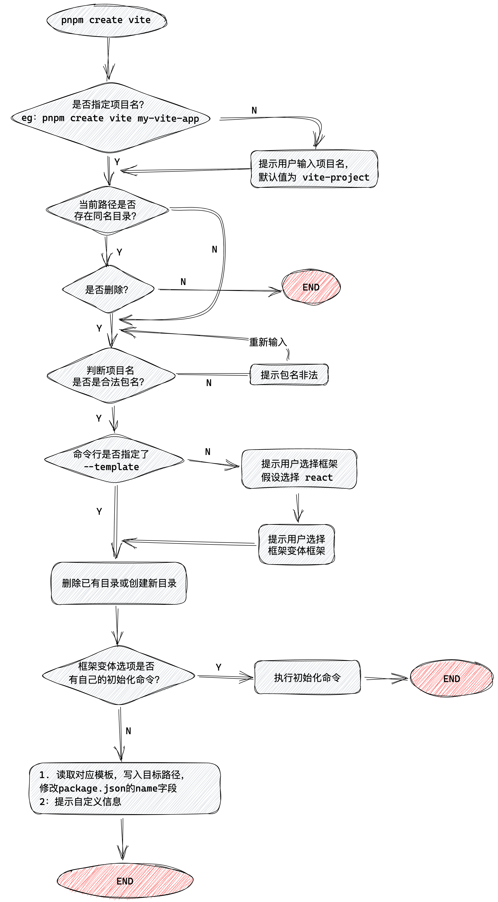

### learn create-vite@4.1.0

1. 这个分支是直接 fork vite 仓库下的 create vite 目录
2. src/index.ts 为主文件，里面几乎每段代码都标有中文注释讲解
3. 目录 analysis 中放了一些大段的讲解文字
4. rollupLicensePlugin.ts 这个插件主要是根据项目开源插件的使用自动生成 LICENSE 文件
5. 项目中中文注释 95% 是由 chatgpt 生成，我只是做了删减以及修改，生成的代码解析非常优秀

有 cli 学习需求的同学可以阅读代码以及对应注释，如果想直接上手使用可以参考 main 分支代码
